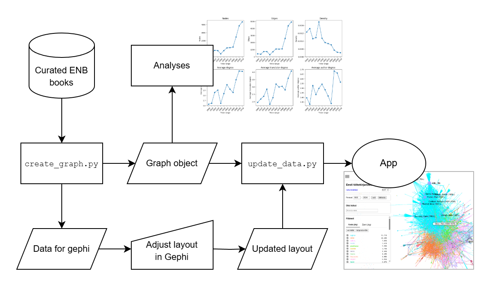

# Network of Estonian Translated Literature

> **Author**: Krister Kruusmaa
>
> **Institutions**: National Library of Estonia, Tallinn University
>
> **License**: [MIT](https://mit-license.org/)

Repository for graph-based analysis and interactive vizualiation of Estonian translated literature, connecting thousands of authors and translators via published works.

Related publications:
- Maris Saagpakk, Daniele Monticelli, Krister Kruusmaa (2024). Eesti tõlkeajaloo digigalaktika toob ilmsiks kultuuri ja ühiskonna aluskoe. ERR Novaator 01.04.2024. [<u>https://novaator.err.ee/1609299408/eesti-tolkeajaloo-digigalaktika-toob-ilmsiks-kultuuri-ja-uhiskonna-aluskoe</u>](https://novaator.err.ee/1609299408/eesti-tolkeajaloo-digigalaktika-toob-ilmsiks-kultuuri-ja-uhiskonna-aluskoe)
- [TBA]

**Interactive app**: [<u>https://data.digar.ee/tkirjandus/index.html</u>](https://data.digar.ee/tkirjandus/index.html)

## Overview and usage

The project contains a back-end and a front-end module. The [`network/`](network/) directory contains scripts to generate a graph object from curated metadata of the [Estonian National Bibliography](https://zenodo.org/records/14083327), as well as analysis notebooks and plots. The [`app`](app/) directory contains code for an Typescript-based interactive web app using Graphology and Sigma modules. To build the network locally, follow these steps:

1. Install the required Python modules via `pip` using the [`reqiurements.txt`](requirements.txt) file.
2. Download the [Curated ENB](https://zenodo.org/records/14083327) dataset and place it into the [`network/data/raw/`](network/data/raw/) directory.
3. Run [`create_graph.py`](./network/src/create_graph.py). This creates two files - a [graph object](./network/data/data.json) file and a [GEXF file](./network/data/gephi/data_for_gephi.gexf).
4. Open the GEXF file with Gephi to to adjust layout and node size, then export it via File -> Export -> Graph object (Gephi v. 0.10.1). Use the same file name as for the existing .gexf file (default `data`).
5. Run [`update_data.py`](./network/src/update_data.py). This updates the JSON file with the custom layout from Gephi, creating an [updated data file](network/data/data_updated.json).
6. Move the updated data file to the [`./app/public/`](app/public/) directory.
7. Use `npm run build` to build the app ([npm](https://www.npmjs.com/) must be installed).
8. Run an HTTP server in the [`./app/build/`](app/build) folder.
9. Enjoy!

## Contributing

Contributions are welcome. You can submit a pull request, open an issue or just contact us!
